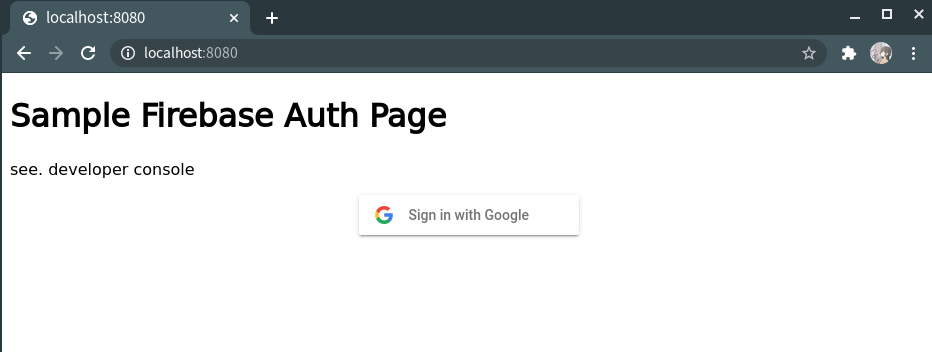

- [Firebase Auth の準備](#org0860710)
- [仮フロントエンドの作成](#org48b05cc)
- [サインイン・サインアウト・サインアップフローの確認](#org4556654)
- [ハンドラの作成](#orgfccb738)
- [infrastructure の実装](#orgb52c22e)
  - [Firebase Auth の token 読み込み](#org29bdbc6)
  - [DB の接続](#orga7aa75c)
- [interface の実装](#org998aa86)
  - [Firebase Auth の token デコード機構](#org67624d5)
  - [SQL の実行機構](#org8a4c8c9)
- [interface の組み込み](#orge2318bb)
- [動作確認](#orgb232a45)

本稿では、Web API を作っていく上で頻出する認証・認可周りの話を、Firebase Auth を用いて片付けます。 一般的に パスワード認証などが基礎のガイドでは紹介されますが、 refresh token を代表とする罠が多すぎるので、外部サービスを利用します。

<a id="org0860710"></a>

# Firebase Auth の準備

1.  Firebase Project よりプロジェクトを追加します。 アナリティクスの追加の有無を聞かれますが、必要に応じて切り替えて下さい。
2.  左メニューの構築タブにある、Authentication より、 Auth のための設定を行います。

    1.  `Sign-in method` より、 Google を有効にします。 Twitter や Yahoo など他のプロバイダもありますが、 Google が以降の設定について一番楽だと思われます。

        アプリの公開名は、わかりやすい名前 (e.g. 本ガイドで言えば、picture-gallery)を設定すると良いでしょう。

    2.  承認済みドメインに `localhost` が指定されていることを確認して下さい。

        公開時には、公開するドメイン (github pages ならば、 xxx.github.io など) を設定する必要があります。

    3.  プロジェクトの設定 → 全般より、 `プロジェクト名` と `プロジェクトID` を入手して下さい。

        

    4.  プロジェクトの設定 → サービスアカウントより、新しい秘密鍵を生成して下さい。生成した秘密鍵の入った JSON ファイルは、 `resources/secrets` に `firebase_secrets.json` として保存して下さい (後の説明のため必要です)。

参考:

- <https://firebase.google.com/docs/auth/web/google-signin?authuser=1#before_you_begin>
- <https://firebase.google.com/docs/admin/setup?hl=ja#initialize-sdk>

<a id="org48b05cc"></a>

# 仮フロントエンドの作成

Firebase Auth はフロントエンドと Firebase の Auth サーバとの通信を繋げて認証情報を獲得します。 そのため、フロントエンドの実装が必須となります。

今回はまず、認証情報を自前の DB に API サーバを通してに持ち込んでいく流れを実装していくので、仮のフロントエンドを作成します。

仮フロントエンドは、http-server (<https://github.com/http-party/http-server>) と １枚の `index.html` を用いて作成します。 まずは仮フロントエンドのプロジェクト作成をします。

```shell
# npm > 5.2.0
mkdir fba_front_sample
cd fba_front_sample
npm init -y
npm install -D http-server
```

次に、index.html を作成します。

<details><summary>index.html (`set your values from firebase project` 部を編集して下さい)</summary>

```html
<!doctype html>
<html>
    <head>
        <meta charset="utf-8">
        <meta http-equiv="x-ua-compatible" content="ie=edge">
        <meta name="viewport" content="width=device-width, initial-scale=1">

        <script src="https://www.gstatic.com/firebasejs/ui/4.6.1/firebase-ui-auth.js"></script>
        <link type="text/css" rel="stylesheet" href="https://www.gstatic.com/firebasejs/ui/4.6.1/firebase-ui-auth.css" />
    </head>
    <body>
        <!-- The surrounding HTML is left untouched by FirebaseUI.
             Your app may use that space for branding, controls and other customizations.-->
        <h1>Sample Firebase Auth Page</h1>
        <div>see. developer console</div>
        <div id="firebaseui-auth-container"></div>
        <div id="loader">Loading...</div>
        <button id="signout">SignOut</div>

        <script src="https://www.gstatic.com/firebasejs/8.2.9/firebase-app.js"></script>
        <script src="https://www.gstatic.com/firebasejs/8.2.9/firebase-auth.js"></script>
        <script type="text/javascript">

         // set your values from firebase project
         // --------------------------------------------
         var apiKey = <your apiKey>
         var projectId = <your project id>
         // --------------------------------------------

         var authDomain = projectId + ".firebaseapp.com"
         var firebaseConfig = {
             apiKey: apiKey,
             authDomain:  authDomain,
             projectId: projectId,
         }
         firebase.initializeApp(firebaseConfig);

         // Initialize the FirebaseUI Widget using Firebase.
         var uiConfig = {
             callbacks: {
                 signInSuccessWithAuthResult: function(authResult, redirectUrl){ return true;},
                 uiShown: function() { document.getElementById("loader").style.display='none'; }
             },
             signInFlow: 'redirect',
             signInSuccessUrl: '/',
             signInOptions: [
                 firebase.auth.GoogleAuthProvider.PROVIDER_ID,
             ]
         }

         var ui = new firebaseui.auth.AuthUI(firebase.auth());
         var signOutButton = document.getElementById("signout");
         // default state
         ui.start('#firebaseui-auth-container', uiConfig);
         signOutButton.style.display='none'

         // already signIned
         firebase.auth().onAuthStateChanged((user) => {
             if (user) {
                 firebase.auth().currentUser.getIdToken(true).then(function(idToken) {
                     console.log("id token is below:")
                     console.log(idToken);
                 })
                 ui.delete()
                 signOutButton.style.display='block'
             }
         })

         // signout
         signOutButton.addEventListener('click', function() {
             console.log("signout")
             firebase.auth().signOut().then(_ => {
                 location.reload()
             })
         })


        </script>

    </body>
</html>
```

</details>

ここまでのプロジェクトのディレクトリ構造は次のようになります。

    .
    ├── index.html
    ├── node_modules
    ├── package-lock.json
    └── package.json

`npx run http-server .` より、http サーバを立ち上げ、 `localhost:8080` より `index.html` へアクセスします。



ログインすると、開発者コンソールに idToken が表示されます。この idToken がサーバへ受け渡したい認証情報となります。

なお、この **認証情報は有効期限がある** ため、 API をテストする際には最新のものを利用する必要があります。

<a id="org4556654"></a>

# サインイン・サインアウト・サインアップフローの確認

<a id="orgfccb738"></a>

# ハンドラの作成

<a id="orgb52c22e"></a>

# infrastructure の実装

Firebase や DB とやり取りをするためにそれぞれとの接続を作る必要があります。この部分は Clean Architecture 的には infrastructure にあたります。

<a id="org29bdbc6"></a>

## Firebase Auth の token 読み込み

<a id="orga7aa75c"></a>

## DB の接続

<a id="org998aa86"></a>

# interface の実装

Firebase Auth の token のデコード、SQL の実行部分は interface にあたるので、実装していきます。 この部分は、usecase との依存関係の方向上、インターフェースを介して (名前の通りですね) やり取りをする必要があるので、 Clojure におけるインターフェースの記述方法一つ、 `defprotocol` を利用して実装します。

<a id="org67624d5"></a>

## Firebase Auth の token デコード機構

<a id="org8a4c8c9"></a>

## SQL の実行機構

<a id="orge2318bb"></a>

# interface の組み込み

<a id="orgb232a45"></a>

# 動作確認
